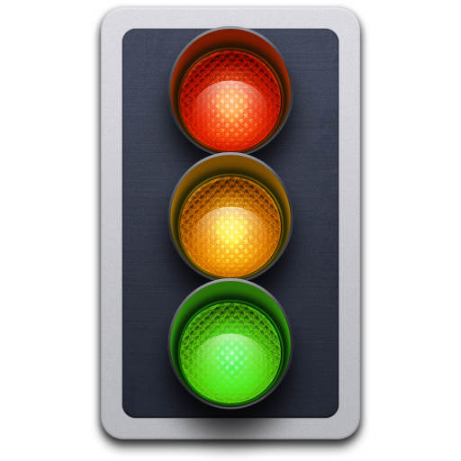
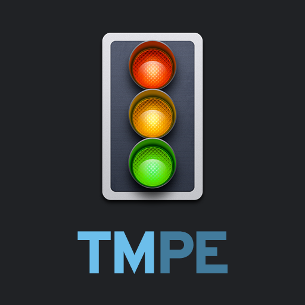
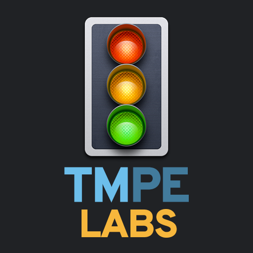
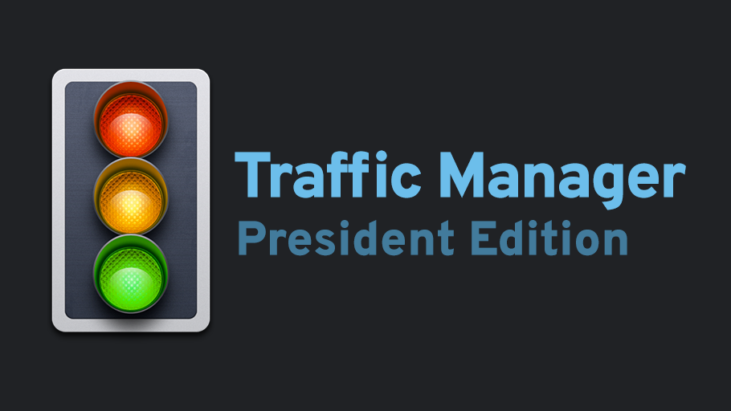
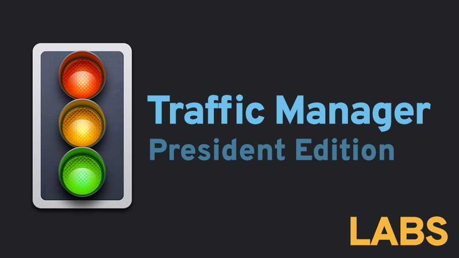
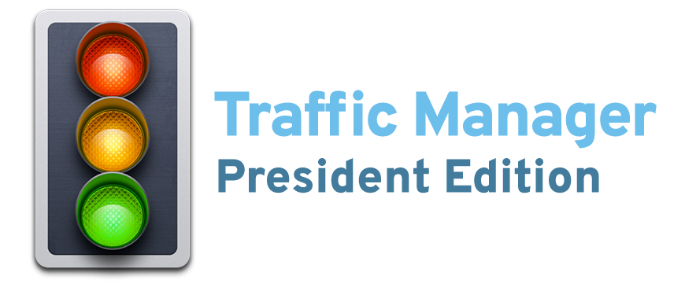
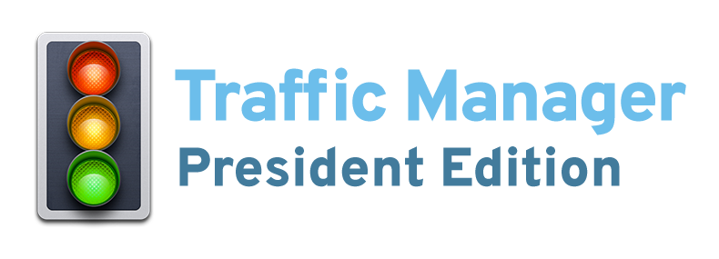

# TM:PE Logos

Yes, it's open source project, but we want it to look nice (:

## Icon

> Icon is subject to copyright and must not be used external to TM:PE project. More details can be found in [Issue #71](https://github.com/krzychu124/Cities-Skylines-Traffic-Manager-President-Edition/issues/71)

[Icon.psd](./Icon.psd)

## Thumbnails

> These are used for small preview images for the mod pages on Steam. They can also be used as Steam Guide thumbnails.

 

[Thumbnail.psd](./Thumbnail.psd)

## Splash screens

> These are used as first screenshot of mod detail pages

[Splash.psd](./Splash.psd)

## Transparent background

> Variations of the splash screens with transparent background. Intended use is documentation, user guides, etc.

